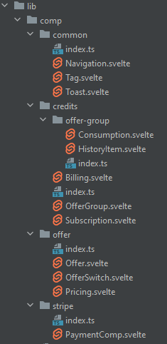

# @user-credits/svelte-ui Library Readme

## Introduction

A demo of this library is [available at this link](https://user-credits.dev)

**[@user-credits/svelte-ui](https://www.npmjs.com/package/@user-credits/svelte-ui)** 
is an open-source library designed to streamline the management 
of user credits (pay-as-you-go models). It ships with user interface components for handling offers, 
order management, payment tracking, and credit consumption in web applications.

Whether you're developing a subscription-based service, a digital marketplace, 
or an e-commerce platform, svelte-ui is built on top of [@user-credits/core](https://www.npmjs.com/package/@user-credits/core) and
relies on its implementations' server side (like [@user-credits/stripe-mongoose](https://www.npmjs.com/package/@user-credits/stripe-mongoose)) 
to allow flexible and technology-agnostic solutions for your billing offer needs.
While the primary implementation is in Svelte, the library is adaptable to other
view technologies, making it a versatile choice for your projects.

**Sorry I don't know how reduce the button size, I like coffee but not to that extent.**
[](https://www.buymeacoffee.com/credits)

## Table of Contents

- [Getting Started](#getting-started)
- [Usage](#usage)
- [License](#license)

## Features

### Screens and Process Flows

user-credits-ui includes screens and process flows for handling offers, offer groups, order management, payment tracking, and credit consumption. The library is built with SvelteKit but may easily be translated to other view technologies like React, Vue or Angular.

### Offers and Offer Groups

- **Offers:** With [@user-credits/stripe-mongoose](https://www.npmjs.com/package/@user-credits/stripe-mongoose), you can create and manage offers, allowing you to define different pricing models, discounts, and customizations. It includes features like offer overriding, enabling tailored pricing for specific user groups or offer groups. You can check the unit tests to see that in action.

- **Offer Groups:** Examples of offer groups include monthly or yearly billing with advantageous or exclusive offers unlocks by purchasing a specific "offer" (offerGroup actually), such as "Insurance" or "Online Course."

### Order Management and Payment

- **Order and Payment:** Users can easily order and pay for offers through user-credits-ui. The library handles the entire order and payment process, allowing users to follow the progress and confirmation of their payments.

- **Subscription Management:** user-credits-ui supports different use cases of offers, including subscription-based offers, consulting offers, and token-based offers.

### Token-Based Offers

- **Token-Based Offers:** Token-based offers provide users with a certain number of credits. These credits can be consumed by related services or products. Users can track their credit consumption for each offer they've purchased.

- **Stats and Monitoring:** user-credits-ui offers detailed statistics and monitoring capabilities, allowing users to see the current state of each token-based offer, making it easy to keep track of their credit usage.

### Multi-Currency Support

user-credits-ui allows you to display orders and prices in multiple currencies, making it suitable for a global audience. While currency conversion is not built-in, user-credits-ui offers seamless integration to sync and manage international payments effortlessly.


## Usage

## Getting Started

### Prerequisits:
To be able to use this project, you'll have to provide a .env file with the following constants (values are just examples):
```
STRIPE_PUBLIC_KEY=pk_live_XYZ
STRIPE_PRIVATE_KEY=sk_live_XYZ
STRIPE_API_VERSION=2023-08-16
DB_URL=mongodb+srv://yourdb
DB_NAME=user-credits
CURRENCY=usd
```

The components are written using preline, a cool library that uses tailwindcss. To get the components to display the css correctly, install Preline [as described](https://medium.com/@FArcieri/install-praline-ui-on-sveltekit-9af72b988744) in this guide.

You'll also need to implement the interface: `IResourceResolver`, as described below.
### Installing
use your package manager to install
>pnpm add @user-credits/base-ui @user-credits/svelte-ui

>yarn add @user-credits/base-ui @user-credits/svelte-ui

>npm install @user-credits/base-ui @user-credits/svelte-ui

#### Choice:
Then install one of 
- Preline to use components and ready to copy screens
>pnpm add -D preline

- TailwindCss to keep working with raw classes 
> npm add -D tailwindcss

### configure
TailwindCss needs to intervene at compile time, so the lib files must be included in the analysis. You that by adding them to the `content` tag
>./node_modules/@user-credits/svelte-ui/dist/**/*.{html,js,svelte,ts}
```javascript 
/** @type {import('tailwindcss').Config}*/
// tailwind.config.js (or cjs)
const config = {
content: ['./src/**/*.{html,js,svelte,ts}', "./node_modules/@user-credits/svelte-ui/dist/**/*.{html,js,svelte,ts}",],

	theme: {
		extend: {}
	},

	plugins: [
		require('preline/plugin'),
	],
	darkMode: 'class',
};

module.exports = config;
```

### Implementing `IResourceResolver`
The interfaces defined in @user-credits/core that are returned by all 
@user-credits implementations only specify the strict necessary fields
to be able to apply its logical operation. For example, the `IOffer` interface
only contains a `name` field that is actually a unique name that allows you to
identify an offer and be able to compete it with relevant resources like: description, 
icons, features it proposes, etc.... 

> Some fields are designed to be interpreted or used as is. For example, the `IOffer` 
> interface includes the fields `currency` and `price`. The resolver has the possibility 
> to use that data to handle converting the price to your website visitor's currency.

You'll need to create your own implementations of the `IResourceResolver` interface. 

For example, `IResourceResolver` converts an offer from an `IOffer` instance containing `name`,`currency` and `price` and returns `OfferDto` (found in the base-ui package) on which the components in this library rely to display information :

```typescript
export class OfferDto<K extends IMinimalId> extends EntityDto<K, IOffer<K>> {
	description: string; // offer short description
	advantages: Map<string, string>; // only the keys are used by the component, but you can hide details in the value
	callToAction: string; // the button label
	highlightingMessage: string; // if it's a special or recommended offer
	constructor(offer: IOffer<K>) {
		super(offer);
	}

	get name(): string {
		return this.delegate.name
	};

	get price(): number {
		return this.delegate.price
	}

	get higlighted(): boolean { // if true, displays as highlighted
		return this.delegate.weight > 0;
	}

}
```

As for any component in this lib, you may decide to extend `OfferDto` and build your own Svelte representation of an offer.

So `IResourceResolver` is kept simple: it receives any data instance from `@user-credits/core/db/model` and transforms it into one of the available `@user-credits/svelte-ui/lib/core/dto/EntityDto` child classes or to your child class dedicated to display it
```typescript
interface IResourceResolver {
	/**
	 * Returns an object to describe a domain as view ready values. For example it will convert and append the right currency to the price, find a language specific title, name, description and return a structured object with these values
	 *
	 * @param domain a key that describes what we expect (which entity to represent)
	 * @param data a raw data object
	 * @template <T> the actual object containing the data to represent, for example @IOfferProps
	 * @template <D> the type of possible objects (an enum like implementation)
	 * return <T> the type the user expects as an output
	 */
	buildDto<
		D extends IResourceDomain,
		K extends IMinimalId,
		M extends IBaseEntity<K>,
		>(
		domain: D,
		data: M,
	): EntityDto<K, M>;


	/**
	 * returns a setting or resolves an ioc instance
	 * @param domain the resource key 
	 */
	getSetting<D extends IResourceDomain>(domain: D): unknown;
}

```

For basic screens, you only need to fill 2 types of objects to represent:
```typescript
import { OfferDto, UserCreditsDto } from '@user-credits/base-ui';
```

 - offers: OfferDto (where you will map an IOffer.name with the other fields to display: description, icons, etc...)
 - credits: UserCreditsDto which already has advanced default behavior

In the demo, the Resolver is pretty forward:
```typescript
	buildDto<D extends IResourceDomain, K extends IMinimalId, M extends IBaseEntity<K>>(domain: D, data: M): EntityDto<K, M> {
		if (!data)
			throw new Error('Data cannot be null: ' + data +' (domain: '+ JSON.stringify(domain) +')');
		switch (domain.type) {
			case 'Offer':
				return resolveOffer<K, M>(data);
			case 'UserCredits':
				return resolveSubscription<K, M>(data, this.getSetting({ type: 'UserPreferences' }) as UserPreferences);

			default:
				throw new Error('Cannot resolve DOMAIN ' + domain.type + ' : ' + data);
		}
	}
```

### Displaying screens:

| Components | that display DTOs in `@user-credits/base-ui` |
|-----------|-----------|
|   |  Once your data is transformed into DTOs, you can use the provided components to represent it, or build/compose your own. |

## Filling data:
Inserting an offer is pretty direct as you see the code below. But to construct your offers wisely, check [this article](https://medium.com/@zhamdi). 

```typescript
import type { IOffer, IOfferDao, IDaoFactory } from "@user-credits/core";
import { ObjectId } from 'bson';

const offerToInsert: IOffer<ObjectId>

export async function prefillOffersForTests(daoFactory: IDaoFactory<ObjectId>) {
	const offerDao = daoFactory.getOfferDao();
	await offerDao.create(offerToInsert); // or await offerDao.build(offerToInsert).save();
}
```

If you're wondering from where to get the `daoFactory` instance, for now it is only implemented for MongoDB.

In the [demo code](https://github.com/ziedHamdi/svelte-user-credits/blob/master/src/hooks/init.ts) of this library, there's a hook in src/hooks.server.ts that calls the init function at server startup. The init function instantiates the Mongoose DaoFactory after 

```typescript
import { MongooseStripeContainerSingleton, connectToDb, disconnectFromDb, resolveConfigReader, resolveStripeClient, MongooseDaoFactory } from '@user-credits/stripe-mongoose';
import { ServiceProxy } from '../lib/server/rest/ServiceProxy';
import { AwilixContainer } from "awilix/lib/container";

async function init(): Promise<void> {
	console.log('Initializing container...');
	iConfigReader = await resolveConfigReader();
	ioc = await MongooseStripeContainerSingleton.getInstance() as unknown as AwilixContainer<object>;
	// Connect to MongoDB
	const connection: Connection = await connectToDb(iConfigReader.dbUrl, iConfigReader.dbName);
	const mongooseDaoFactory = new MongooseDaoFactory(connection);
	const paymentClient = await resolveStripeClient();
	service = new PaymentService(mongooseDaoFactory, paymentClient, iConfigReader.currency ?? 'usd') as unknown as IService<Types.ObjectId>;
	ioc.register({ service: asValue(service) });
	serviceProxy = new ServiceProxy<Types.ObjectId>(service);
	ioc.register({ serviceProxy: asValue(serviceProxy) });
	console.log('Connected to MongoDB');
}
```

Each step here can be configured. Let's dig a bit into the details:
 - `resolveConfigReader` is imported from '@user-credits/stripe-mongoose' as a simple .env config file reader. Your project might have another way to store configs. This is the place where you can override that: just implement the `IConfigReader` imported from the same project and pass it instead.
 - `MongooseStripeContainerSingleton` is, as it name suggests, a singleton that intiates mongoose and stripe. However, it relies on the default config reader. It is also an opinionated solution as it relies on the Awilix IOC container. If you need to implement your own `IConfigReader`, then you will need to create your own singleton. The only job it does is to create the instances and store them in the Awilix container.
 - `connectToDb` doesn't need to explain, then we can create the 'MongooseDaoFactory' with that connection. If your business has multiple connections to different databases, MongooseDaoFactory handles that, but you will have to check the code in `@user-credits/stripe-mongoose`
 - 'resolveStripeClient()' simply reads back from `MongooseStripeContainerSingleton` saved in the Awilix container
 - `new PaymentService(mongooseDaoFactory, paymentClient, 'usd' )` is the instance it is decided that we are using mongoose and stripe with the lib.
 - `ServiceProxy` is the shadow implementation of [IService](https://github.com/ziedHamdi/user-credits-core/blob/master/src/service/IService.ts) but adapted to web requests (getting request and answering with Response). We also inject it to the container to make it available to the entire app.

# The available services:
## IService
The IService interface is pretty self-explanatory, let's rapidly describe a sequence of calls you will typically make:
 - loadOffers allows you to load different offers depending on the connected user, as the library @user-credits/core allows offers to be **unlocked** on other offer purchases 
 - createOrder(offerId, userId) translates a user with the intention to purchase an offer, this saves the order in db, and allows you to remind the user of his intent later. When called, the library also calls Stripe and gets back to you with a **client-secret**; a code you will use the library to attempt to process a payment 
 - afterExecute(order: IOrder<K>): When stripe responds, you can call this method to check what happened. You can also call this method from a webhook (check Stripe documentation). Anyway, this method only receives an orderId, and asks stripe by itself to be sure
 - loadUserCredits(userId): this loads a synthesis of all user data, if a payment failed, he'll be able to find it there
 - payOrder(orderId): can be called to attempt a payment for an order that failed previously
 - tokensConsumed(userId,offerGroup,count): this is the very purpose of the entire library: to be able to consume tokens on the go. A User can always see his status by navigating through the object returned by loadUserCredits()
 - getDaoFactory(): this allows you to access more finely grained operations with databases.
```typescript
import type { IDaoFactory } from "../db/dao/types";
import type {
IMinimalId,
IOffer,
IOrder,
ITokenTimetable,
IUserCredits,
} from "../db/model/types";

/**
* This is the main interface for the UserCredits library, allowing clients to interact with pay-as-you-go features.
*
* ⚠️ **WARNING:** Before using any of these methods, ensure that you have thoroughly checked and validated user
* permissions and rules. This documentation assumes that you are in a secure and controlled environment when executing
* these calls.
*
* @template K - The type of foreign keys used throughout the library.
  */
  export interface IService<K extends IMinimalId> {
  /**
    * This method is called by the web client (or by the payment webhook server callback) after a payment has been
    * executed by the client library, whether it was successful or not.
    * It updates the user's credits based on the provided order status.
    *
    * @param {IOrder<K>} order - The order resulting from a payment transaction.
    * @returns {Promise<IUserCredits<K>>} A promise that resolves to the updated user credits.
      */
      afterExecute(order: IOrder<K>): Promise<IUserCredits<K>>;

/**
* Creates an order for a user from a selected offer, saving the user's intention to purchase the offer.
*
* @param {unknown} offerId - The unique identifier of the selected offer.
* @param {unknown} userId - The unique identifier of the user initiating the order.
* @returns {Promise<IOrder<K>>} A promise that resolves to the created order.
  */
  createOrder(offerId: unknown, userId: unknown): Promise<IOrder<K>>;

/**
* You can define your own logic for key equality
* @param {K} a - a key
* @param {K} b - the other key
* @returns {boolean} true if the keys are equal, false otherwise.
  */
  equals(a: K, b: K): boolean;

/**
* Provides access to the data access objects (DAOs) used to store data locally within the application.
* This includes DAOs for offers, orders, token timetables, and user credits.
*
* @returns {IDaoFactory<K>} The DAO factory for accessing and manipulating local data.
  */
  getDaoFactory(): IDaoFactory<K>;

/**
* Retrieves a list of filtered anonymous offers and user-exclusive offers based on a user's unique identifier.
* Exclusive offers become visible to users after they purchase a basic offer with the status 'paid'.
* Exclusive offers can be overridden by other purchased offers using the `overridingKey` and `weight` properties,
* allowing for customization of pricing and duration.
*
* Please read {@link /docs/offer_loading_explained.md} for a detailed explanation.
*
* @param {unknown} userId - The unique identifier of the user.
* @param {string[]} envTags - The tags to filter the base offers with.
* @returns {Promise<IOffer<K>[]>} A promise that resolves to an array of offers available to the user.
  */
  loadOffers(userId: unknown, envTags: string[]): Promise<IOffer<K>[]>;

/**
* Loads the current user credits status object
* @param {K} userId - user id
* @returns {Promise<IUserCredits<K> | null>} A promise that resolves to an {@link IUserCredits} instance if found, or `null` otherwise.
  */
  loadUserCredits(userId: K): Promise<IUserCredits<K>>;

/**
* Creates a payment intent for a user from a selected offer, saving the user's intention to purchase the offer.
*
* @param {K} orderId - The unique identifier of the selected order.
* @returns {Promise<IOrder<K>>} A promise that resolves to the updated order.
  */
  payOrder(orderId: K): Promise<IOrder<K>>;

/**
* Consumes the count number of tokens for a specific offer group of the user.
*
* Please note that if the user is not subscribed to the offer, we will not throw an exception.
* This is intentional to allow consuming before paying:
* It's up to your code to check that a user is allowed to consume from an offerGroup before letting him pass.
*
* You can do that by scanning the {@link IUserCredits.offers} field in the object returned by {@link IService.loadUserCredits}
*
* @param {K} userId - The unique identifier of the user.
* @param {string} offerGroup - The offer group for which to retrieve the remaining tokens.
* @param {number} count - The number of tokens consumed.
  */
  tokensConsumed(
  userId: K,
  offerGroup: string,
  count: number,
  ): Promise<ITokenTimetable<K>>;
  }
```
## Contributing

user-credits-ui is an open-source project, and we welcome contributions from the community. If you'd like to contribute, please follow the standard [contribution guidelines](https://docs.github.com/en/get-started/quickstart/contributing-to-projects).

## License

user-credits-ui is licensed under the MIT License. You can find the full license details in the [LICENSE](LICENSE) file.

We hope you find user-credits-ui useful for your project. If you have any questions or need assistance, please don't hesitate to reach out to us.

Happy coding with user-credits-ui! 🚀

---

[GitHub Repository](https://github.com/ziedHamdi/svelte-user-credits)

Some code will be moved to a [front-end agnostic library project](https://github.com/ziedHamdi/user-credits-ui)

[comment]: <> ([API Documentation]&#40;https://user-credits-ui-docs.com/api&#41;)

[comment]: <> ([User Guide]&#40;https://user-credits-ui-docs.com/guide&#41;)
